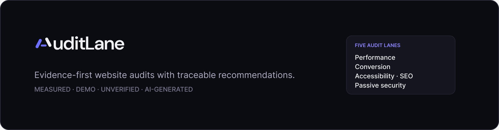
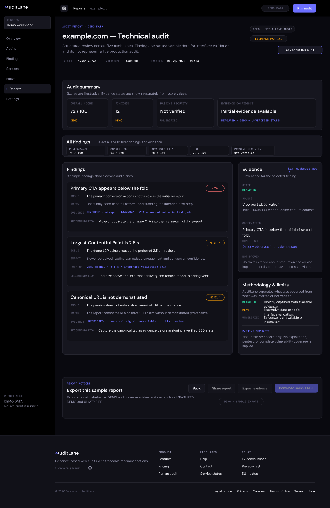
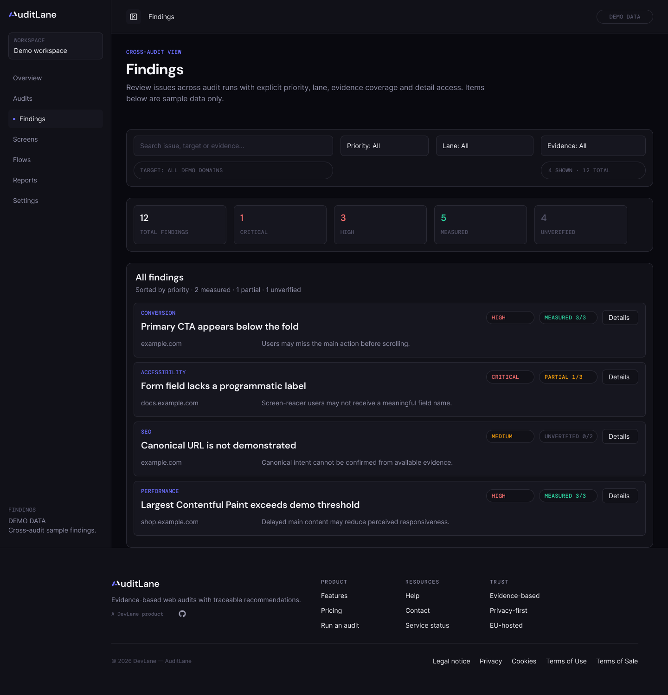
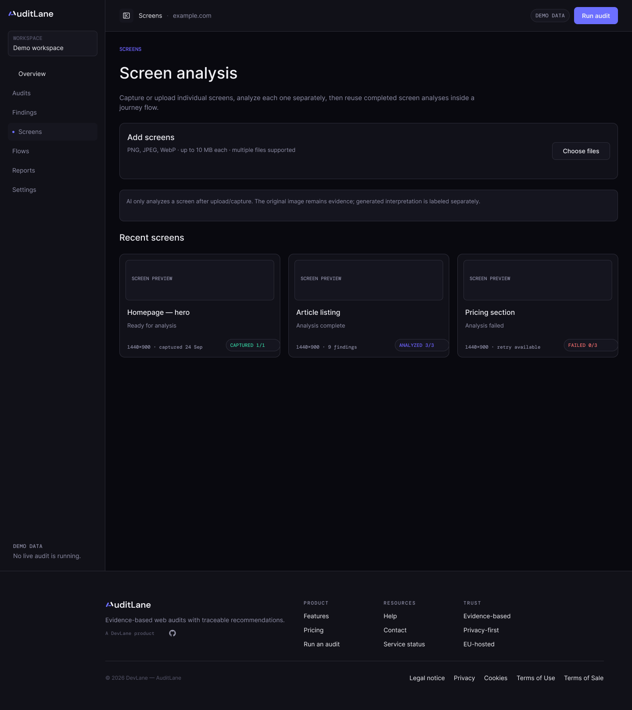

  

# AuditLane

**Evidence-first website auditing for teams that need findings they can trace, review, and act on.**

> **Status:** active development · public product repository · proprietary application source is private

AuditLane is a DevLane product focused on structured website audits across five complementary lanes:

- **Performance**
- **Conversion**
- **Accessibility**
- **SEO**
- **Passive security**

The core idea is simple: **do not blur observed evidence, demo values, AI interpretation, and unverified claims into one opaque score.**

---

## Why AuditLane

Many audit tools are useful at surfacing problems, but the final report can make it difficult to see:

- what was directly measured,
- what was observed from available evidence,
- what was inferred,
- what remains unverified,
- and what should be done next.

AuditLane is being designed around a clearer evidence model so each finding can be reviewed with its provenance and limits visible.

---

## Evidence model

AuditLane keeps evidence states explicit instead of silently turning missing information into a positive result.

| State | Meaning |
| --- | --- |
| **MEASURED** | Directly captured or measured from available evidence. |
| **DEMO** | Illustrative or interface-validation data. Not a live production measurement. |
| **UNVERIFIED** | Evidence is unavailable or insufficient to support the claim. |
| **AI-GENERATED** | AI-assisted interpretation or synthesis, kept separate from source evidence. |

A recommendation should remain traceable back to the evidence that supports it.

---

## Five audit lanes

### Performance
Page-speed and rendering signals, measured values, bottlenecks, and practical remediation priorities.

### Conversion
UX and conversion observations focused on clarity, hierarchy, decision paths, friction, and evidence-backed recommendations.

### Accessibility
Structured accessibility checks and findings with explicit evidence and remediation guidance.

### SEO
Technical SEO signals such as metadata, canonicalisation, indexability, and other auditable page-level signals.

### Passive security
Non-invasive, externally observable security signals. AuditLane does **not** present unavailable security evidence as verified.

---

## From finding to action

AuditLane is designed around a consistent finding structure:

**Issue → Impact → Evidence → Recommendation → Priority**

The goal is not to produce more findings. The goal is to make findings easier to understand, verify, prioritise, and revisit.

---

## Product preview

The screenshots below are **design previews from the current AuditLane V1 product work**. They may contain illustrative or demo data and should not be interpreted as the output of a live production audit.

### Audit report

  

<table>
  <tr>
    <td width="50%" valign="top">
      <strong>Findings</strong>  
      
    </td>
    <td width="50%" valign="top">
      <strong>Screen analysis</strong>  
      
    </td>
  </tr>
</table>

These previews reflect the product principle used throughout AuditLane: **evidence states and AI interpretation remain explicitly separated**.

---

## Product direction

AuditLane is currently in active development.

Current product work includes:

- the evidence and provenance model,
- the audit execution pipeline,
- audit reports and finding details,
- screen and journey-flow analysis,
- audit comparison and history,
- public read-only report sharing,
- contextual product guidance,
- subscription and account flows.

The first product version is being designed in **English**.

For the current public direction, see **[ROADMAP.md](ROADMAP.md)**.

---

## Public repository

This repository is the **public home of AuditLane on GitHub**.

It is intended for:

- product information,
- public documentation,
- project updates,
- feedback and issue tracking where appropriate,
- selected public technical notes.

> **The proprietary AuditLane application source code is not published in this repository.**

Security-sensitive implementation details, infrastructure secrets, credentials, internal audit material, and private operational documentation will not be published here.

### Repository guide

- **[ROADMAP.md](ROADMAP.md)** — public product direction
- **[SECURITY.md](SECURITY.md)** — how security-sensitive reports should be handled
- **[CONTRIBUTING.md](CONTRIBUTING.md)** — useful public feedback and contribution guidance
- **Issues** — reproducible product/UX issues and public suggestions

---

## Status

AuditLane is under active development and is not yet presented here as a generally available production service.

Product previews, screenshots, sample metrics, and demo reports may contain **illustrative data**. Demo data should not be interpreted as the result of a live audit unless explicitly identified as such.

---

## Built by DevLane

AuditLane is a product by **DevLane**.

GitHub: https://github.com/DevLane-IT

---

## Feedback

Public product feedback, documentation suggestions, and reproducible UX issues are welcome through this repository as the public project matures.

For security-sensitive matters, please do **not** post exploitable details in a public issue. Read **[SECURITY.md](SECURITY.md)** first.

---

© 2026 DevLane — AuditLane
